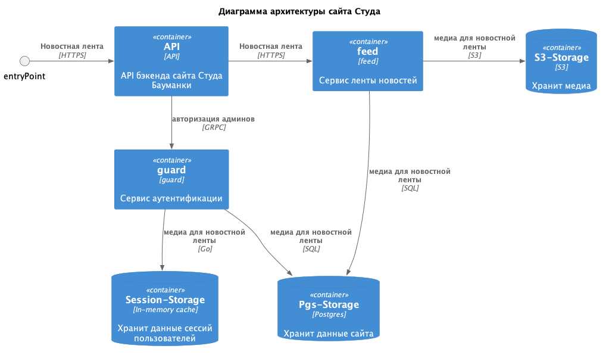

**Диаграмма архитектуры**

**Пример названия векти:**
_SWP-5bc-add-guard-service_
  * SWP-5bc - номер задачи

**Пример названия PR или коммита:**
_SWP-5bc m.ivanov feat guard: add new grpc-service_
  * SWP-5bc - номер задачи
  * m.ivanov - кто коммитит или создает RP
  * feat guard - с чем работаешь (с сервисом guard)
  * add new grpc-service -  описание коммита или PR
